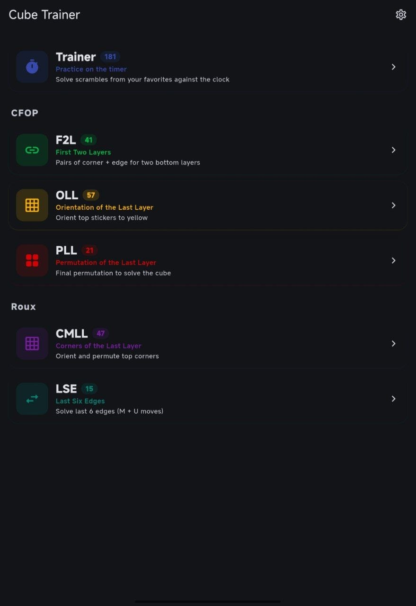
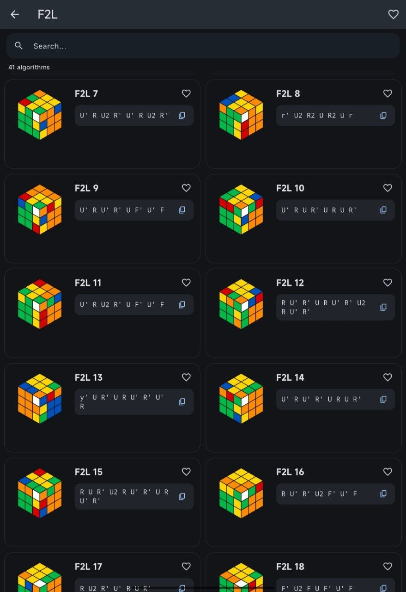
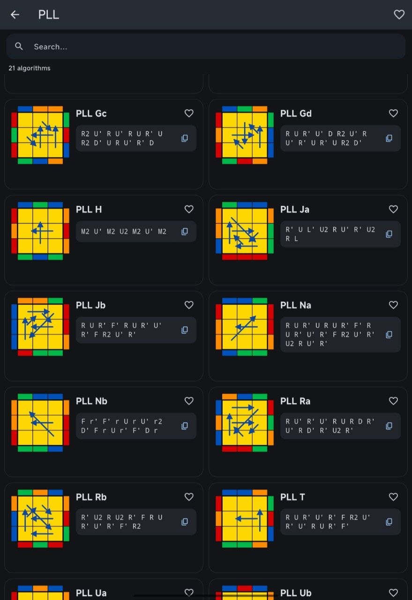
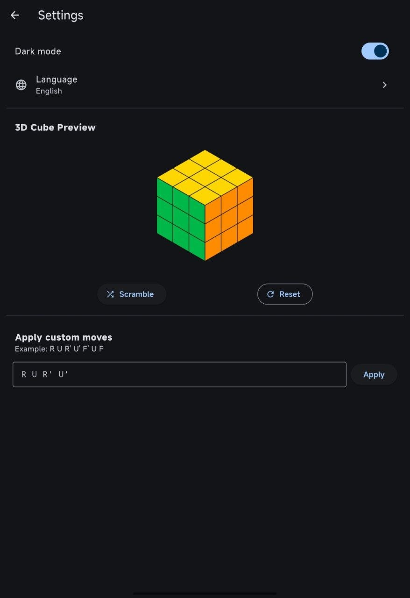
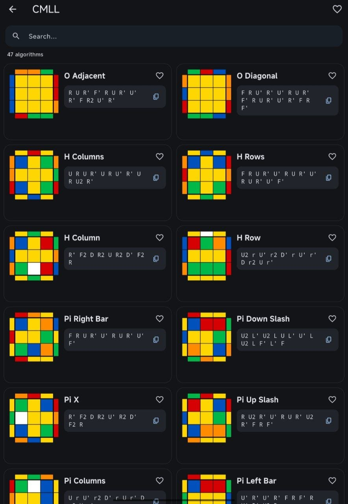

# Cube Trainer

A Flutter app for learning and training CFOP and Roux algorithms.

## Features

- **176 algorithms** across two methods
  - **CFOP**: F2L (41), OLL (57), PLL (21)
  - **Roux**: CMLL (42), LSE (15)
- **3D cube preview** for F2L cases
- **Top view with arrows** for OLL, PLL, CMLL, and LSE
- **Search** across all sections
- **Favorites** to mark algorithms you want to focus on
- **9 languages**: English, Русский, Українська, 中文, Español, Deutsch, Français, Português, Italiano
- **Dark mode**
- **Responsive layout** for phones, tablets, and desktops

## Download

- **Android**: [app-release.apk](../../releases/latest)
- **Windows**: [cube-trainer-windows.zip](../../releases/latest)

## Screenshots

  
  
  
  
  

## How it works

Each algorithm card shows:

- A visual representation of the cube state after the scramble
- The algorithm itself
- A copy button for quick access

For F2L, the cube is rendered in 3D. For last-layer algorithms, the top view is displayed with arrows showing how pieces move during the permutation.
