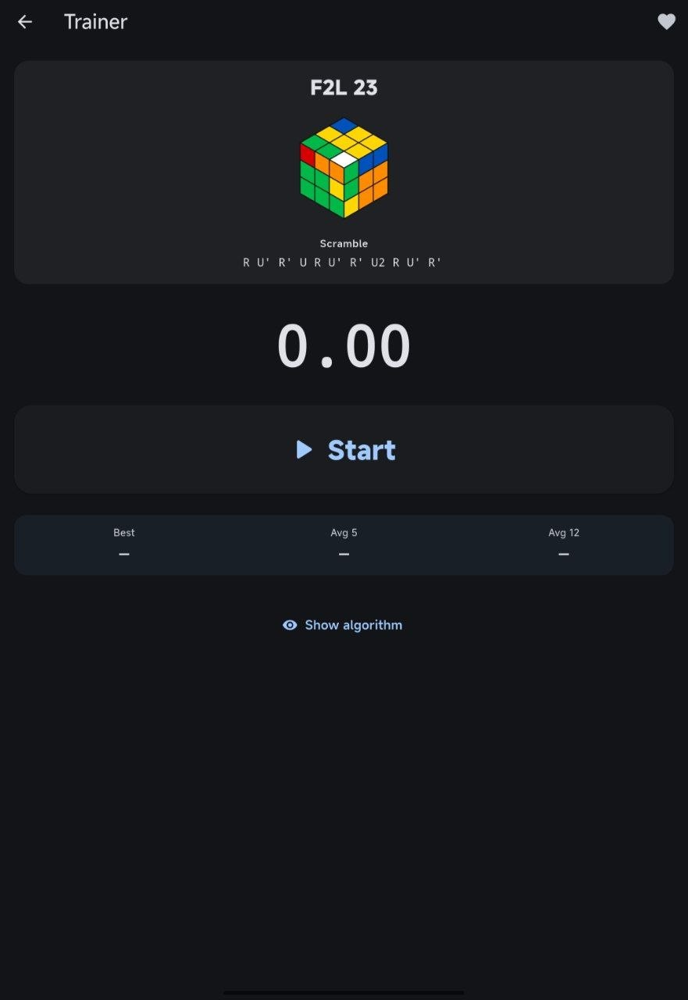

# Cube Trainer

A Flutter app for learning and training CFOP and Roux algorithms.

[](https://flutter.dev)
[](LICENSE)
[](https://github.com/cellonty/cube-trainer/releases)
[](https://github.com/cellonty/cube-trainer/releases)

## Features

- **176 algorithms** across two methods
  - **CFOP**: F2L (41), OLL (57), PLL (21)
  - **Roux**: CMLL (42), LSE (15)
- **Trainer** — practice your favorites on the timer
  - Solve scrambles against the clock
  - Best time, average of 5 and 12 per case
  - History of recent solves, tracked separately for each algorithm
- **3D cube preview** for F2L cases
- **Top view with arrows** for OLL, PLL, CMLL, and LSE
- **Search** across all sections
- **Favorites** to mark algorithms you want to focus on
- **9 languages**: English, Русский, Українська, 中文, Español, Deutsch, Français, Português, Italiano
- **Dark mode**
- **Responsive layout** for phones, tablets, and desktops

## Download

- **Android**: [app-release.apk](../../releases/latest)
- **Windows**: [cube-trainer-windows.zip](../../releases/latest)

## Screenshots

<p align="center">
  
  
  
  
  
  
</p>

## How it works

Each algorithm card shows:

- A visual representation of the cube state after the scramble
- The algorithm itself
- A copy button for quick access

For F2L, the cube is rendered in 3D. For last-layer algorithms, the top view is displayed with arrows showing how pieces move during the permutation.

### Trainer

The **Trainer** section pulls algorithms from your favorites (or all if favorites are empty) and shows the scramble. You then:

1. Apply the scramble to your real cube.
2. Tap **Start** to begin the timer.
3. Solve the case.
4. Tap **Stop** to record your time.

Times are saved per-case, so you can track improvement on each specific algorithm. Best, Avg 5, and Avg 12 are shown at a glance.

## Algorithms

All algorithms were verified against trusted sources:

- **F2L, PLL**: SpeedCubeDB
- **OLL**: CubeSkills (Feliks Zemdegs)
- **CMLL, LSE**: Bradley K. Hobbs and Kian Mansour references

Scrambles are computed automatically as the inverse of each algorithm.

## Building

### Android

```bash
flutter build apk --release
